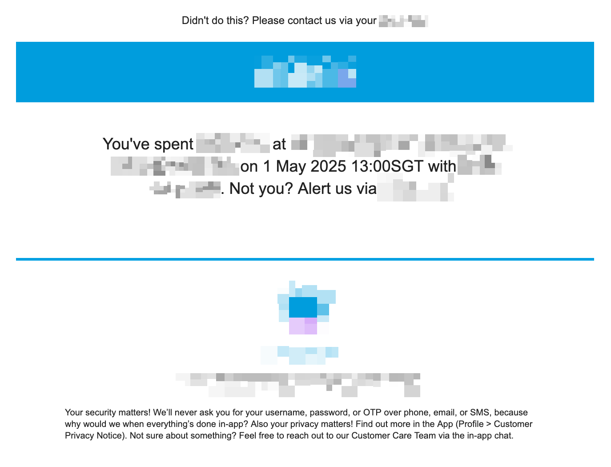
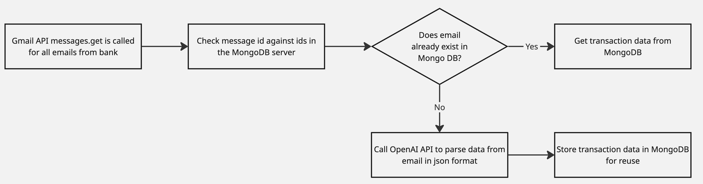
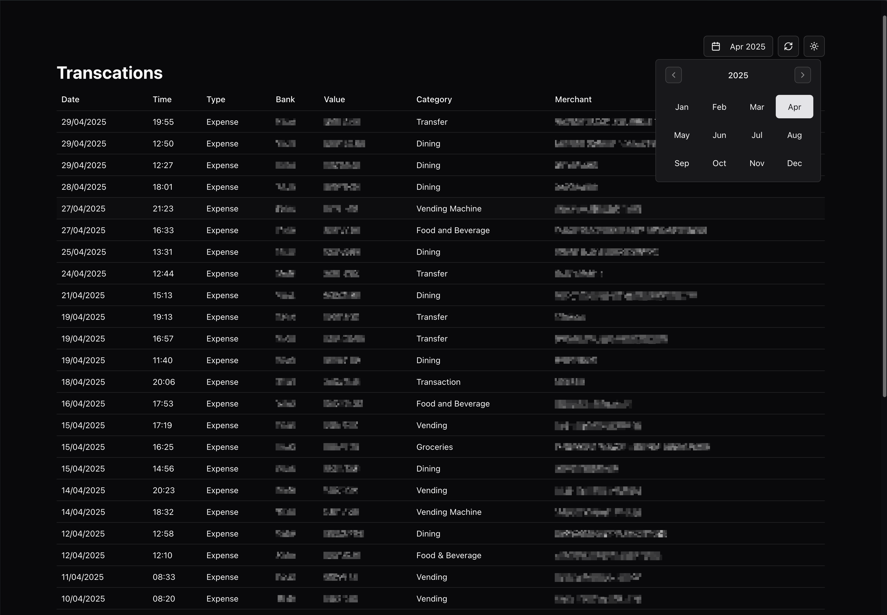

<h1 align="center">
Transaction Tracker
</h1>

> _Web App that collates bank transactions from Gmail and displays it in a readable table format._

## Set Up

I did not build this app with deployment in mind, but instead just as a proof of concept and practice for building react apps. To use the app in development mode only or deploying it requires your own api keys and environment variables.

1. MongoDB URI
2. OpenAI Key

Add an .env file to the root folder

```
MONGODB_URI="mongodb://your_uri_here"
OPENAI_API_KEY="your_key_here"
```

3. Google credentials.json file

Create a new google cloud project and create a service account with access to the gmail api. Then create the credentials for the service account and place the credentials.json in the root folder. [For reference](https://developers.google.com/workspace/guides/create-credentials).

To test, run the project using the following command:

```bash
$ npm run dev
```

## Problem

I've been trying to be more financially responsible lately. This involved attempting to be more mindful of my spending habits and transactions.

With the advent the cashless society, it has been increasingly difficult for me to guage how much I am spending, which would eventually lead to me overspending my budget.

Initially, I attempted to use personal finance tracking apps like [Money Manager](https://www.realbyteapps.com/). These apps provided a good way to visualise spending habits and make me more aware of what I was spending my money on.

The issue with such apps is the requirement that transactions be manually entered. Some have bank integrations that allow for automatic transcation tracking, but they are either paid solutions or do not have support for Singaporean banks. Without an established habit, it is difficult to get myself to remember to key in every single transaction that I perform.

Therefore this app was created to circumvent this issue and perform automatic tracking of transactions.

## Solution

Initially I explored if my local bank had easily accessible API's that I could tap into to access transaction information. However it was clear that for security and privacy reasons this was not the case

I noticed that every time a transaction was made, the bank would send me an email with all the transaction details. These emails could easily be accessed using the Gmail API

However, the format of the emails could vary from bank to bank or even from transaction to transcation. Since the emails were provided in a html document format, it would be difficult to parse out the information for different test cases.

<p align="center">
</img>
</p>
<p align="center">
<i>Sample email</i>
</p>

I decided use OpenAI's ChatGPT API to parse the text from the image. This made the solution more universal, working of several email formats from different banks.

To prevent constant calls to the paid ChatGPT API, I decided to save already processed text to a MongoDB database.

The workflow is as follows:

<p align="center">
</img>
</p>
<p align="center">
<i>Flowchart</i>
</p>

## Interface

<p align="center">
</img>
</p>
<p align="center">
<i>Screenshot</i>
</p>
